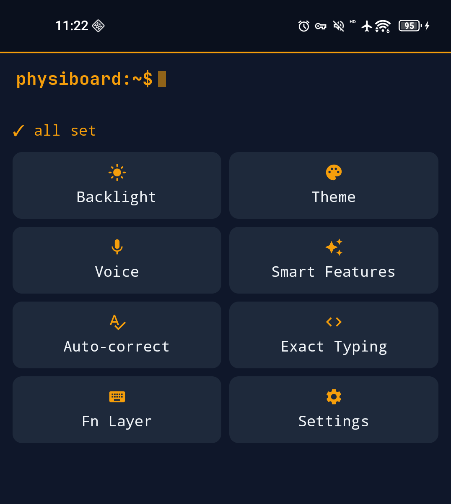
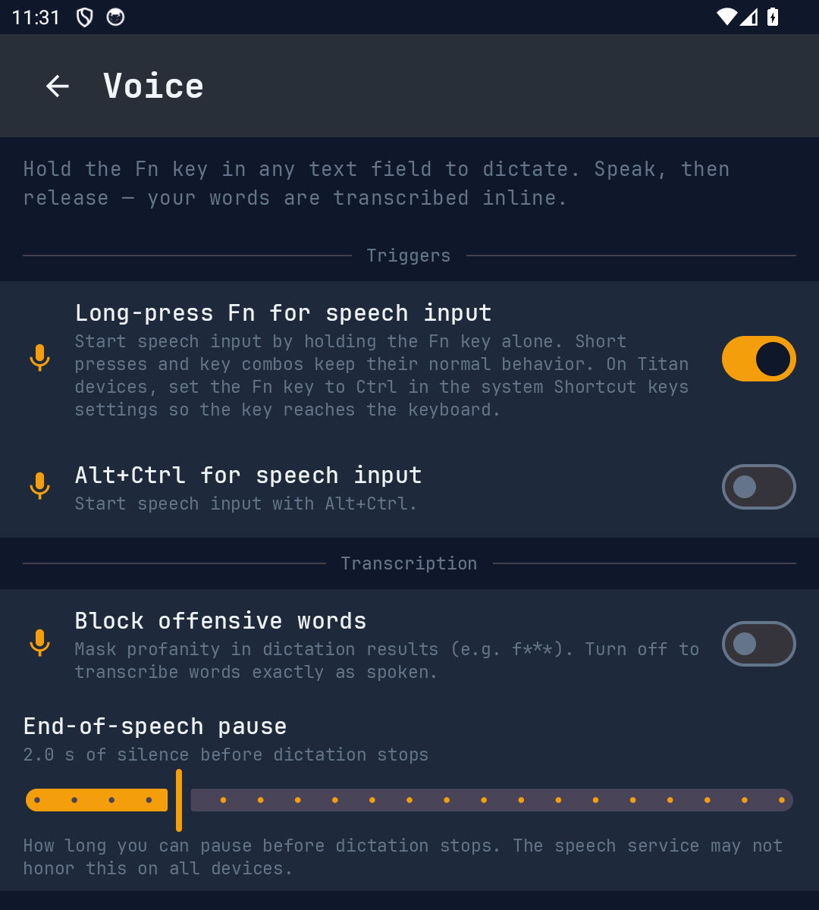
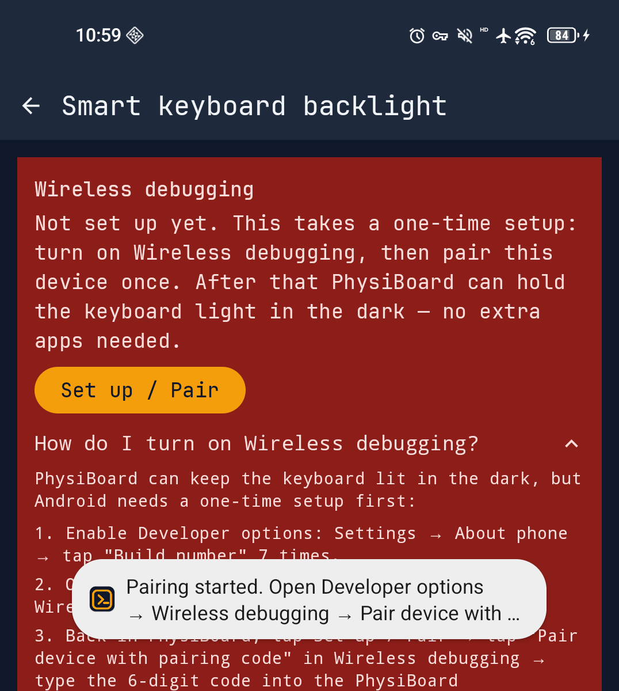
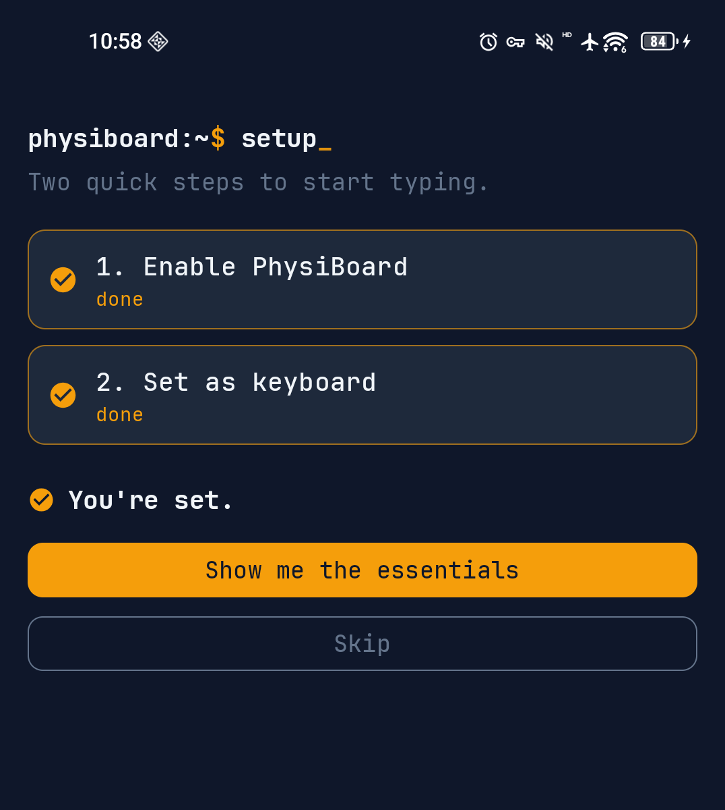
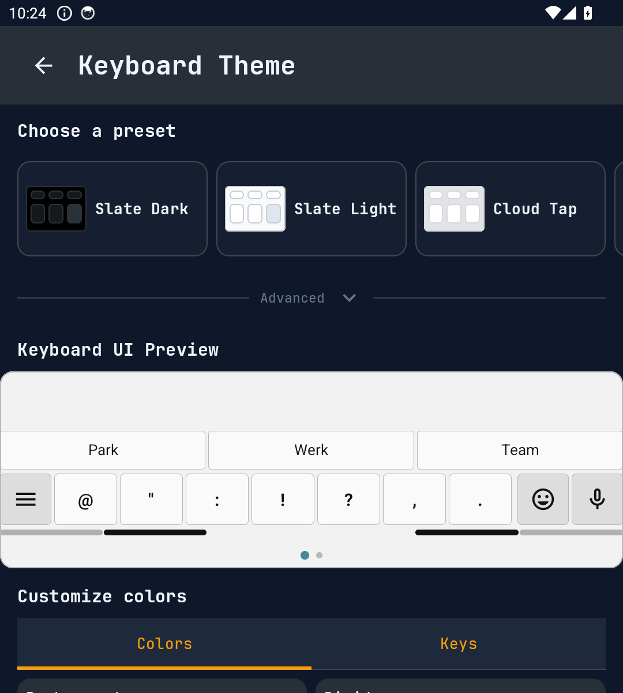

# PhysiBoard


Input method for physical-keyboard Android devices (e.g. Unihertz Titan 2 Elite), designed to make typing faster through shortcuts, gestures, dictation, and customization.

PhysiBoard is a **fork of [Pastiera](https://github.com/palsoftware/pastiera)** by Andrea Palumbo (PalSoftware) and its contributors — the keyboard engine is their work. This fork adds a physical-keyboard-focused feature set (hold-Fn dictation, an always-on-in-the-dark backlight, a terminal-style UI) on top of it.

> If you'd like to support the people who built the engine PhysiBoard runs on, back the original project on **[OpenCollective](https://opencollective.com/pastiera)**. This fork doesn't take donations of its own.

<p align="center">
  
</p>

## What this fork adds

Full change notes (per GPLv3 §5(a)) are in [PHYSIBOARD_CHANGES.md](PHYSIBOARD_CHANGES.md).

- **Hold Fn to dictate** — hold the Fn key in any text field to start voice typing. Matched by hardware scan code so vendor Fn remapping can't break it. Haptic cues, an adjustable end-of-speech pause (default 2s), and a real profanity-masking toggle.
- **Smart keyboard backlight** — keeps the keyboard lit past the vendor's 30-second cap while the screen is on and the room is dark, driven entirely in-app over the device's own wireless debugging (no companion app, no root). Guided one-time setup and a post-reboot reminder.
- **Terminal UI** — slate + amber, JetBrains Mono throughout, and an action-surface home that only surfaces what needs attention.
- **Sensible defaults + two-step onboarding** — auto-capitalization off, dictation on, dark-aware backlight, follow-system theme, and a decluttered settings tree with search.

## Quick overview

- Compact status bar with LED indicators for Shift/Alt, a variants/suggestions bar, and swipe-pad gestures to move the cursor.
- Multiple layouts (QWERTY/AZERTY/QWERTZ, Greek, Cyrillic, Arabic, translit, etc.), fully configurable with JSON import/export.
- SYM pages usable via touch or physical keys (emoji + symbols), reorderable/disableable, with an integrated editor.
- Clipboard history with pinnable items.
- Dictionary-based suggestions and autocorrection, with swipe-to-accept.
- Hold-Fn voice dictation and an always-on-in-the-dark keyboard backlight (this fork).
- Full backup/restore (settings, layouts, variations, dictionaries) and built-in update checks.

## Typing and modifiers

- Long-press a key to input Alt+key or Shift+key (timing configurable).
- Shift/Ctrl/Alt in one-shot or lock mode (double-tap), option to clear Alt on space.
- **Fn Layer** (Pastiera's Nav Mode): double-tap Ctrl outside text fields to turn letter keys into arrows and editing/shortcut actions — fully customizable.
- Standard shortcuts: Ctrl+C/X/V, Ctrl+A, Ctrl+Backspace, arrow/selection/page shortcuts (all customizable).

## Voice dictation *(fork)*

- Hold the Fn key in any text field to start voice typing; release to stop.
- Adjustable end-of-speech pause (0–10s, default 2s), profanity masking toggle, and start/stop haptic cues.
- Optional Alt+Ctrl trigger; the microphone is also always available on the variants bar.

## Keyboard backlight *(fork)*

- Keeps the keyboard lit in the dark while the screen is on, past the vendor's 30-second cap.
- Runs entirely in-app by pairing once with Android's own Wireless debugging — no companion app, no root.
- A darkness (lux) threshold, a live "right now" reading, a guided setup walkthrough, and a post-reboot reminder.

## Keyboard layouts

- Included layouts: qwerty, azerty, qwertz, greek, arabic, russian/armenian phonetic translit, plus dedicated Alt maps for Titan.
- JSON import/export directly from the app, with visual preview and list management.
- Layout maps live under `files/keyboard_layouts` and can be edited manually.

## Symbols, emoji, and variations

- Touch-based SYM pages (emoji + symbols): reorderable/enableable, auto-close after input, customizable keycaps.
- In-app SYM editor with emoji grid and Unicode picker.
- A variations bar above the keyboard showing accents/variants of the last typed letter.

## Suggestions and autocorrection

- Dictionary-based suggestions and autocorrection with swipe-to-accept.
- User dictionary with search and edit.
- Per-language auto-substitution editor.
- **Exact typing** *(fork)*: pick apps (terminals, editors) where suggestions, autocorrect, auto-capitalization, and double-space-period are all disabled.

## Comfort and extra input

- Double-space → period + space + uppercase.
- Physical-key swipe to move the cursor and accept suggestions.
- Compact status bar; with the on-screen keyboard disabled it uses even less space (PhysiBar mode).

## Backup, updates, and data

- UI-based backup/restore in ZIP format (preferences, layouts, variations, SYM/Ctrl maps, dictionaries).
- Built-in GitHub update check when opening settings.

## Screenshots

<p align="center">
  
  
  
  
</p>

## Installation

1. Build the APK (below) or install an existing build from [Releases](../../releases).
2. Android Settings → System → Languages & input → On-screen keyboard / Manage keyboards.
3. Enable **PhysiBoard**, then select it from the input selector when typing. (The app's two-step onboarding walks you through this.)

## Requirements

- Android 11 (API 30) or higher.
- A device with a physical keyboard (profiled on the Unihertz Titan 2 Elite; adaptable via JSON). The smart backlight is Titan 2 Elite-specific; everything else works on any hardware-keyboard Android phone.

## Development

Standard Gradle Android project. The physical-keyboard release flavor is `physi` (application id `brobata.physiboard`):

```bash
./gradlew :app:assemblePhysiDebug
```

Run the core + routing + service modifier regression tests:

```bash
./gradlew :app:testStableDebugUnitTest \
  --tests it.palsoftware.pastiera.core.ModifierStateControllerTest \
  --tests it.palsoftware.pastiera.inputmethod.InputEventRouterModifierE2ETest
```

Release signing is read from Gradle properties / environment variables (`PASTIERA_KEYSTORE_PATH`, `PASTIERA_KEYSTORE_PASSWORD`, `PASTIERA_KEY_ALIAS`, `PASTIERA_KEY_PASSWORD`) — no keys are committed. See [CONTRIBUTING.md](CONTRIBUTING.md).

The internal source namespace remains `it.palsoftware.pastiera` on purpose: it keeps the fork lineage honest and merges from upstream possible. Only the user-facing application id and branding are PhysiBoard.

## Continuous Integration

Pushes to `main` and pull requests run `.github/workflows/ci.yml` (inherited from Pastiera), which runs the stable and nightly unit-test suites.

## Based on Pastiera

PhysiBoard is a fork of [Pastiera](https://github.com/palsoftware/pastiera). The entire keyboard engine — layouts, modifier handling, suggestions, virtual-keyboard mode, the settings framework — comes from there. Several PhysiBoard features are intended as upstream pull requests back to Pastiera.

## License

PhysiBoard is licensed under the **GNU General Public License, version 3** — the same as Pastiera. See [LICENSE](LICENSE).

Bundled third-party components (AOSP LatinIME, JetBrains Mono, the vendored Shizuku wireless-ADB code and `libadb.so`, Unicode CLDR data, Leipzig frequency data, CC0 sound samples) retain their own licenses — see [THIRD_PARTY_NOTICES.md](THIRD_PARTY_NOTICES.md).

## Credits

PhysiBoard exists because of **Pastiera** by Andrea Palumbo (PalSoftware) and its contributors. In-app credits (Settings → About) carry the full contributor and upstream-license attributions.
